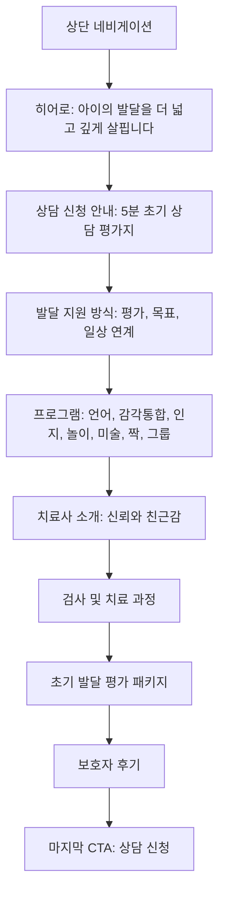

# 편한몸 의원 부설 미래아이 심리발달 클리닉 랜딩 페이지 와이어프레임

## 1. 와이어프레임 목표

보호자가 첫 화면에서 센터의 성격을 이해하고, 페이지를 읽어가며 신뢰를 쌓은 뒤 `상담 신청` 또는 `전화상담`으로 자연스럽게 이동하도록 구성한다.

주요 CTA:

- `상담 신청`: `https://child-developmental-assessment-form-sage.vercel.app/`
- `전화상담`: 전화번호 확정 후 `tel:` 링크 또는 전화번호 안내

## 2. 전체 페이지 흐름



## 3. Desktop 와이어프레임

### 3.1 상단 네비게이션

목적:

- 브랜드 인지
- 전화상담과 상담 신청 진입점 제공
- 긴 페이지 안에서 주요 섹션으로 이동

구성:

- 좌측: 로고
- 중앙 또는 우측 메뉴: `프로그램`, `치료 과정`, `후기`, `상담 신청`
- 우측 CTA: `전화상담`

레이아웃:

```text
[LOGO]                         프로그램  치료 과정  후기  상담 신청   [전화상담]
```

비고:

- 상단은 스크롤 시 고정 여부를 검토한다.
- 모바일에서는 메뉴를 줄이고 `상담 신청`, `전화상담`만 우선 노출한다.

### 3.2 히어로

목적:

- 첫 화면에서 보호자의 고민에 바로 응답
- 센터의 전문 영역과 상담 CTA를 즉시 전달
- 실제 센터 공간 이미지를 통해 신뢰감 형성

구성:

- 좌측: 메인 카피, 설명 문구, CTA
- 우측: 센터 로비 이미지

카피:

```text
아이의 발달을
더 넓고 깊게 살핍니다
```

보조 문구:

```text
아이의 발달은 한 가지 영역만으로 설명되지 않습니다.
언어, 인지, 운동, 감각, 사회성 등 전반적인 발달 상태를 체계적으로 평가하고
아이에게 필요한 맞춤 치료교육을 통해 건강한 성장을 함께 만들어갑니다.
```

CTA:

- Primary: `상담 신청`
- Secondary: `전화상담`

레이아웃:

```text
┌──────────────────────────────┬──────────────────────────────┐
│ 아이의 발달을                │                              │
│ 더 넓고 깊게 살핍니다        │        center-lobby.jpeg      │
│                              │                              │
│ 설명 문구                    │                              │
│                              │                              │
│ [상담 신청] [전화상담]       │                              │
└──────────────────────────────┴──────────────────────────────┘
```

디자인 메모:

- 이미지에는 어두운 오버레이를 과하게 쓰지 않는다.
- 첫 화면 하단에 다음 섹션 일부가 보이도록 히어로 높이를 과도하게 키우지 않는다.

### 3.3 초기 상담 평가지 안내

목적:

- 상담 신청 버튼이 어디로 이어지는지 설명
- 외부 폼 이동에 대한 심리적 부담 완화

구성:

- 섹션 제목: `상담 전, 간단한 문진으로 아이의 상태를 먼저 알려주세요`
- 설명: `약 5분 정도 소요되는 아동 발달 초기 상담 평가지입니다.`
- 보조 안내: `작성 내용은 상담 목적에만 사용됩니다.`
- CTA: `초기 상담 평가지 작성하기`

레이아웃:

```text
┌──────────────────────────────────────────────────────────────┐
│ 상담 전, 간단한 문진으로 아이의 상태를 먼저 알려주세요       │
│ 약 5분 정도 소요되는 아동 발달 초기 상담 평가지입니다.       │
│ 작성 내용은 상담 목적에만 사용됩니다.                       │
│                                                              │
│ [초기 상담 평가지 작성하기]                                  │
└──────────────────────────────────────────────────────────────┘
```

CTA 동작:

- 클릭 시 `https://child-developmental-assessment-form-sage.vercel.app/`로 이동

비고:

- PDF 2쪽과 마지막 쪽 이미지는 외부 폼의 초기 화면 참고이며, 랜딩 페이지 내부에 폼을 직접 구현하지 않는다.

### 3.4 발달 지원 방식

목적:

- 센터가 아이를 종합적으로 이해하고 계획을 세운다는 메시지 전달
- 단순 프로그램 나열 전에 진단/목표/연계의 프레임 제공

구성:

1. 현재 상태를 정확히 이해합니다.
2. 아이에게 맞는 목표를 세웁니다.
3. 일상으로 이어지는 변화를 돕습니다.

레이아웃:

```text
아이에게 필요한 발달 지원을 함께 찾아갑니다

┌──────────────┐ ┌──────────────┐ ┌──────────────┐
│ 아이콘        │ │ 아이콘        │ │ 아이콘        │
│ 현재 상태     │ │ 맞춤 목표     │ │ 일상 연계     │
│ 설명 문구     │ │ 설명 문구     │ │ 설명 문구     │
└──────────────┘ └──────────────┘ └──────────────┘
```

디자인 메모:

- 카드 3개는 같은 높이로 맞춘다.
- 아이콘은 선형 아이콘 또는 부드러운 일러스트 중 하나로 통일한다.

### 3.5 프로그램

목적:

- 어떤 치료 프로그램을 제공하는지 한눈에 전달
- 보호자가 자신의 아이에게 필요한 영역을 빠르게 찾게 함

섹션 카피:

```text
아이마다 다른 가능성, 미래아이가 함께 키워갑니다.
아이의 강점과 발달 속도에 맞춘 다양한 치료 프로그램을 통해
스스로 성장할 수 있는 힘을 길러줍니다.
```

프로그램:

- 언어치료
- 감각통합치료
- 인지치료
- 놀이치료
- 미술치료
- 짝치료
- 그룹치료

레이아웃:

```text
PROGRAM
아이마다 다른 가능성, 미래아이가 함께 키워갑니다.

┌────────────┐ ┌────────────┐ ┌────────────┐
│ 언어치료    │ │ 감각통합치료 │ │ 인지치료    │
│ 설명        │ │ 설명        │ │ 설명        │
└────────────┘ └────────────┘ └────────────┘

┌────────────┐ ┌────────────┐ ┌────────────┐
│ 놀이치료    │ │ 미술치료    │ │ 짝치료      │
│ 설명        │ │ 설명        │ │ 설명        │
└────────────┘ └────────────┘ └────────────┘

┌────────────┐
│ 그룹치료    │
│ 설명        │
└────────────┘
```

비고:

- 7개 프로그램이라 desktop에서는 3열 + 3열 + 1열 구성이 어색할 수 있다.
- 대안으로 대표 4개를 큰 카드로, 나머지 3개를 보조 카드로 배치하는 방식도 검토한다.

### 3.6 치료사 소개

목적:

- 보호자가 실제로 아이를 만날 사람들에 대한 신뢰감을 갖도록 함
- 전문성보다 먼저 편안함과 안정감을 전달

구성 옵션:

- 옵션 A: 실제 치료사 프로필 카드
- 옵션 B: 실제 이름 없이 분야별 선생님 카드
- 옵션 C: 원장님 소개 + 분야별 치료팀 소개

권장:

- 실제 인물 정보가 준비되지 않았다면 `원장님 소개 + 치료 분야별 팀 소개`로 시작
- 캐릭터형 익명 카드만으로 구성하면 신뢰감이 약해질 수 있음

레이아웃:

```text
선생님들을 소개합니다

┌────────────┐ ┌────────────┐ ┌────────────┐ ┌────────────┐
│ 원장님      │ │ 언어 선생님 │ │ 감각통합    │ │ 인지/놀이   │
│ 사진/이미지 │ │ 사진/이미지 │ │ 사진/이미지 │ │ 사진/이미지 │
│ 소개 문구   │ │ 소개 문구   │ │ 소개 문구   │ │ 소개 문구   │
└────────────┘ └────────────┘ └────────────┘ └────────────┘
```

상호작용:

- desktop: 가로 카드 슬라이더 또는 4열 노출
- mobile: 가로 스와이프 카드

### 3.7 검사 및 치료 과정

목적:

- 상담 이후 진행 과정을 예측 가능하게 만들어 불안감 완화
- 패키지 구성과 자연스럽게 연결

단계:

1. 원장님 초진 및 발달 확인
2. 발달 전문가 심층 검사
3. 검사 결과 해석상담
4. 1회 치료 경험

레이아웃:

```text
아이에게 필요한 치료 방향을 함께 찾아갑니다

01 원장님 초진 및 발달 확인
   아이의 현재 상태와 보호자 상담 내용을 바탕으로 전반적인 발달 흐름을 확인합니다.

02 발달 전문가 심층 검사
   언어, 인지, 감각, 운동, 사회성 등 필요한 발달 영역을 세밀하게 평가합니다.

03 검사 결과 해석상담
   검사 결과를 바탕으로 발달 특성과 현재 수준, 필요한 치료 방향을 안내합니다.

04 1회 치료 경험
   치료 적합성과 향후 진행 방향을 함께 확인합니다.
```

디자인 메모:

- 세로 타임라인이 적합하다.
- desktop에서는 좌우 교차형보다 단순한 4단계 흐름이 더 읽기 쉽다.

### 3.8 초기 발달 평가 패키지

목적:

- 상담을 시작할 구체적 이유와 비용 정보를 제공
- 페이지 중후반에서 강한 전환 포인트 역할

카피:

```text
편한몸, 편한마음으로 시작하는 발달치료
```

구성:

```text
원장님 초진 + 보호자 체크리스트 + 심층 검사 + 해석상담 + 1회 치료
총 60,000원
```

레이아웃:

```text
┌──────────────────────────────────────────────────────────────┐
│ 편한몸, 편한마음으로 시작하는 발달치료                       │
│ 아이의 발달이 걱정되는 순간, 부담 없이 상담과 평가를 시작하세요 │
│                                                              │
│ 원장님 초진 + 보호자 체크리스트 + 심층 검사 + 해석상담 + 1회 치료 │
│ 총 60,000원                                                   │
│                                                              │
│ [상담 신청]                                                   │
└──────────────────────────────────────────────────────────────┘
```

주의:

- 가격과 구성은 최종 확인 후 노출한다.
- 의료/상담 서비스 특성상 치료 효과를 보장하는 표현은 피한다.

### 3.9 보호자 후기

목적:

- 보호자가 느낄 수 있는 안심 포인트를 실제 목소리처럼 전달
- 기능 설명 이후 감정적 신뢰를 보강

구성:

- 대표 후기 3-5개 우선 노출
- 전체 10개는 슬라이더로 확장 가능

레이아웃:

```text
아이의 변화를 함께 확인한 보호자 이야기

┌──────────────┐ ┌──────────────┐ ┌──────────────┐
│ "치료 시간을  │ │ "말로 표현하는 │ │ "방향이 잡혀  │
│ 기다려요."    │ │ 일이 늘었어요."│ │ 안심됐어요."  │
│ 서브 문구     │ │ 서브 문구     │ │ 서브 문구     │
└──────────────┘ └──────────────┘ └──────────────┘
```

비고:

- 실제 후기 사용 가능 여부를 확인한다.
- 예시 후기라면 `보호자 후기` 대신 `상담 후 기대할 수 있는 변화` 형태로 바꾸는 것이 안전하다.

### 3.10 마지막 CTA

목적:

- 페이지를 끝까지 본 보호자를 상담 신청으로 전환
- 보호자의 감정에 공감하는 문장으로 마무리

카피:

```text
아이의 작은 신호에도,
함께 마음을 기울입니다.
```

보조 문구:

```text
원장님과 다양한 치료사들이 함께 아이를 바라보며
보호자님의 마음까지 다정하게 헤아립니다.
```

레이아웃:

```text
┌──────────────────────────────────────────────────────────────┐
│ 아이의 작은 신호에도, 함께 마음을 기울입니다.                │
│ 원장님과 다양한 치료사들이 함께 아이를 바라보며              │
│ 보호자님의 마음까지 다정하게 헤아립니다.                    │
│                                                              │
│ [상담 신청] [전화상담]                                       │
└──────────────────────────────────────────────────────────────┘
```

### 3.11 푸터

목적:

- 기본 사업장 정보와 문의 정보를 제공

구성:

- 센터명
- 주소
- 전화번호
- 운영 시간
- 사업자/의료기관 관련 정보가 필요하면 추가

레이아웃:

```text
편한몸 의원 부설 미래아이 심리발달 클리닉
주소 / 전화번호 / 운영 시간
```

## 4. Mobile 와이어프레임

### 4.1 모바일 상단

구성:

- 좌측 로고
- 우측 `전화상담` 아이콘 버튼 또는 텍스트 버튼
- 하단 고정 CTA 검토

레이아웃:

```text
[LOGO]                                      [전화]

하단 고정:
[상담 신청] [전화상담]
```

### 4.2 모바일 히어로

레이아웃:

```text
아이의 발달을
더 넓고 깊게 살핍니다

설명 문구

[상담 신청]
[전화상담]

center-lobby.jpeg
```

비고:

- 모바일에서는 텍스트 먼저, 이미지 다음 순서를 권장한다.
- CTA는 첫 화면 안에서 반드시 보여야 한다.

### 4.3 모바일 섹션 규칙

- 카드형 섹션은 대부분 1열
- 프로그램은 1열 또는 2열
- 치료사 소개와 후기는 가로 스와이프 허용
- 과정 섹션은 세로 타임라인 고정
- 하단 고정 CTA를 쓸 경우, 마지막 CTA와 중복이 과하지 않도록 조정

## 5. CTA 배치 규칙

상담 신청 CTA는 4곳에 배치한다.

1. 상단 네비게이션
2. 히어로
3. 초기 발달 평가 패키지
4. 마지막 CTA

버튼 문구 우선순위:

- 기본: `상담 신청`
- 설명형: `초기 상담 평가지 작성하기`
- 하단 CTA: `상담 신청하기`

모든 상담 신청 CTA는 동일 URL로 이동한다.

```text
https://child-developmental-assessment-form-sage.vercel.app/
```

## 6. Motion 애니메이션 적용

현재 구현은 `motion` 라이브러리를 사용해 핵심 섹션에 차분한 애니메이션을 적용한다.

- 히어로 텍스트: 약한 fade-in + 위로 등장
- 히어로 이미지: 약한 fade-in + `scale 0.98 -> 1`
- 상담 안내와 패키지 CTA: 가벼운 scroll reveal
- 발달 지원, 프로그램, 치료팀, 과정, 후기 카드: 순차 등장
- 상담 신청/전화상담 CTA: hover/tap 시 약한 반응

구현 기준:

- `app/page.tsx`는 Server Component로 유지
- Motion 관련 코드는 `app/components/Motion.tsx`의 Client Component 래퍼에서 관리
- `useReducedMotion()`으로 동작 줄이기 설정을 존중
- `LazyMotion`, `domAnimation`, `motion/react-m` 조합으로 번들 크기 증가를 줄임

## 7. 콘텐츠 정리 필요 항목

- `코아` 문구는 `미래아이` 또는 전체 센터명으로 교체
- 전화상담 번호 확정
- 치료사 소개 방식 확정
- 후기 문구의 실제 사용 가능 여부 확인
- 패키지 가격 `60,000원` 최종 확인
- 주소, 운영 시간, 지도 노출 여부 확인

## 8. 구현 전 결정안

현재 와이어프레임 기준 권장 결정:

- 상담 신청 링크는 새 탭보다 현재 탭 이동을 우선 검토
- 상담 신청 버튼은 페이지 안에서 반복하되, 같은 문구와 같은 URL을 유지
- PDF의 상담 평가지 이미지는 실제 페이지에 이미지로 넣지 않음
- 첫 화면 이미지는 `center-lobby.jpeg` 사용
- 캐릭터 일러스트보다 실제 공간 이미지와 정돈된 정보 구조를 우선
